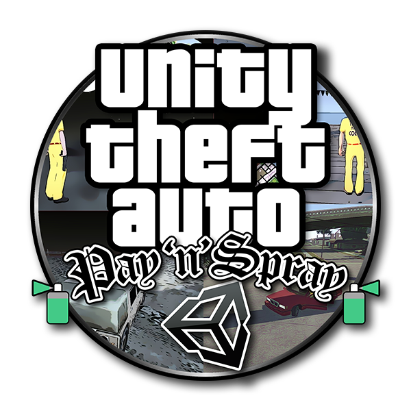

# Unity Theft Auto

 

 

 &nbsp;  &nbsp; 

 

We're porting [GTA: San 
Andreas](http://www.rockstargames.com/sanandreas/) to Unity!

This won't be a complete re-implementation of the game, but we're hoping 
to build something similar to [Multi Theft Auto](http://www.mtasa.com/) 
with assets streamed from an existing installation of San Andreas.

## How to request access

Please, to request acces to the [main repo](https://gitlab.com/uta-gi/uta-pns) send a mail to <a href="mailto:unitytheftauto@gmail.com">unitytheftauto@gmail.com</a> or write a message to @z3nth10n#0775 on Discord or a message to [@z3nth10n on Telegram](https://t.me/z3nth10n).

## Setup Instructions

- open the project
- open main scene located at Assets/Scenes/Main.unity
- press Play button

When running for the first time, the game will ask you for path to GTA 
installation, and will store that path in config.user.json. If you ever 
need to change the path, you can just edit this file.

## In-game controls

Press Escape while in game to open pause menu. You'll see there a lot of 
utilities, and among them, there is a window which shows all controls.

## TODO List

Here is an extensive list of [what should be 
implemented](/Docs/TODO.md).

Can help us to develop this ? In that case, join us on discord so we can 
discuss about it.

## Screenshots

## Videos

### First networking test

### Basic car physics

###

###

